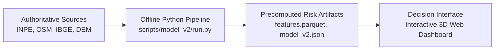
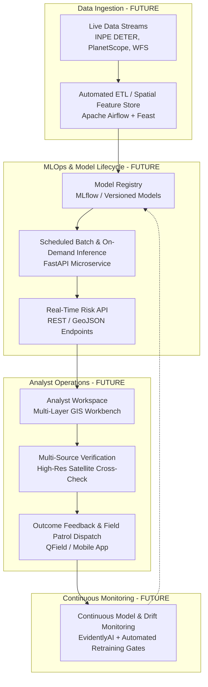

# Phase 6G: Post-Competition Target Architecture

> **Architecture Transition**: Evolution from Research Prototype to Enterprise Decision Support System  
> **Rule of Design**: Explicit separation between current operational prototype and future production components.

---

## 1. Architectural Comparison

### A. Current Architecture (Competition Prototype)



```
┌────────────────────────────────────────────────────────────────────────────────────────┐
│ CURRENT ARCHITECTURE FLOW                                                              │
│ [Data Sources] ──> [Offline Model] ──> [Precomputed Risk] ──> [Decision Interface]     │
├────────────────────────────────────────────────────────────────────────────────────────┤
│ • Data Sources: Static GeoJSON/JSON cached in data/external/                           │
│ • Offline Model: XGBoost 3.4.1 trained via scripts/model_v2/run.py                    │
│ • Precomputed Risk: Parquet/JSON artifacts stored under artifacts/model-v2/            │
│ • Decision Interface: Client-side Mapbox GL / deck.gl web application (zero backend)  │
└────────────────────────────────────────────────────────────────────────────────────────┘
```

---

### B. Future Target Architecture (Production Deployment)



```
┌────────────────────────────────────────────────────────────────────────────────────────┐
│ FUTURE PRODUCTION ARCHITECTURE FLOW                                                    │
│ [Live Data (FUTURE)]                                                                   │
│   ├──> [ETL / Feature Store (FUTURE)]                                                  │
│         ├──> [Model Registry (FUTURE)]                                                 │
│               ├──> [Scheduled Inference (FUTURE)]                                      │
│                     ├──> [Risk API (FUTURE)]                                           │
│                           ├──> [Analyst Workspace (FUTURE)]                            │
│                                 ├──> [Verification (FUTURE)]                           │
│                                       ├──> [Outcome Feedback (FUTURE)]                 │
│                                             └──> [Model Monitoring (FUTURE)]           │
└────────────────────────────────────────────────────────────────────────────────────────┘
```

---

## 2. Component Specifications (Future vs. Current)

1. **Live Data Ingestion [FUTURE]**:
   Automated listeners connecting to INPE TerraBrasilis WFS and DETER alert STAC endpoints to ingest daily deforestation radar and optical alerts.
2. **Spatial Feature Store [FUTURE]**:
   Managed spatial feature repository (Feast / Hopsworks) maintaining point-in-time feature vectors with time-to-live (TTL) invalidation.
3. **Scheduled Inference Engine [FUTURE]**:
   Containerized inference workers running on Kubernetes (EKS/GKE) executing monthly territorial risk surface recalibration.
4. **Risk API [FUTURE]**:
   Authenticated REST API serving spatial vectors, bounding-box queries, and GeoTIFF risk tiles.
5. **Analyst Workspace [FUTURE]**:
   Collaborative web GIS environment for environmental enforcement agents with split-screen satellite change detection.
6. **Closed-Loop Outcome Feedback [FUTURE]**:
   Field enforcement reports and verified ground infractions feed back into the feature store to continuously update training labels.
